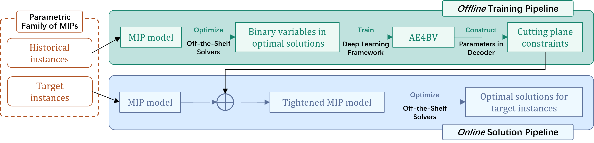
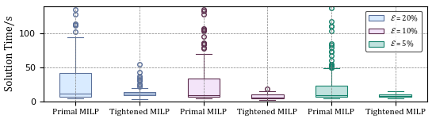
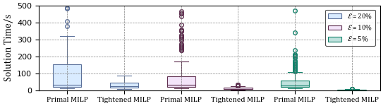
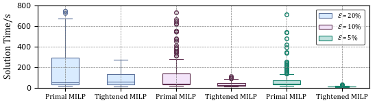

# AE4BV

This repository contains the implementation of the paper: Towards An Unsupervised Learning Scheme for Efficiently Solving Parameterized Mixed-Integer Programs

[Arxiv](https://arxiv.org/)

<center></center>


We presented **a novel L2O scheme** that lies at the intersection of unsupervised learning and operations research. It makes use of **AE4BV** to disentangle the latent structure of binary variables of optimal solutions and accelerate the solution process of a *parametric family* of MIPs. By adding a class of *cutting plane constraints* generated from a trained AE4BV, tightened MIPs can be formulated for new problem instances and then resolved by off-the-shelf solvers with a higher efficiency.

When applied to a benchmark batch process scheduling problem, our approach achieved a **reduction in solution time by an order of magnitude** while achieving an optimality loss of less than 1%.


## Get Start

1. **Enviromental Setup**:

   We utilize [Gurobi](https://www.gurobi.com/), [COPT](https://www.shanshu.ai/copt), [SCIP](https://www.scipopt.org/) as the MILP solvers in solution experiments which need to be installed additionally according to their documents. The other dependencies can be installed: 

   ```
   conda env create -f environment.yml
   ```

2. ***Offline* Training**: 

   The data utilized in the training pipeline is organized into two datasets: the training dataset, located at `data/Data_Train`, and the test dataset, located at `data/Data_Test`. Both datasets, as used in this study, are included in the repository at the specified paths, providing full access to the data necessary for reproducing our experiments.

   To carry out the training pipeline, you can just run the code:

   ```python
   python offline_train.py
   ```

3. ***Online* Solution**:

   During the online solution pipeline, the solver file for a specific problem background needs slight adjustments as outlined in the paper. These adjustments include adding the following constraints:
   $$
   \begin{align}
   &\boldsymbol{W}^\top\boldsymbol{h} + \boldsymbol{a} \geq M\cdot(\boldsymbol{u} - \mathbf{1})\\
           &\boldsymbol{W}^\top\boldsymbol{h} + \boldsymbol{a} \leq M\cdot\boldsymbol{u} \\
    \end{align}
   $$
   To provide an intuitive example of the proposed method, we present the MILP formulation of the batch process scheduling problem `solver/bpssolver.py` as discussed in the paper, along with the tightened model  `solver/bpssolver_opt.py` obtained by applying the proposed approach. 

   For solving the target instances, you can just run the code:

   ```python
   python solver/bpssolver_opt.py
   ```

   

## Experiments Results

When applied to a benchmark batch process scheduling problem, our approach achieved a reduction in solution time by an order of magnitude while achieving an optimality loss of less than 1%. These findings highlight the effectiveness of AE4BV in enhancing the efficiency and practicality of solving MIPs.



<center>The solution time using Gurobi</center>



<center>The solution time using COPT</center>



<center>The solution time using SCIP</center>

## Citation

If you found this repository useful, please consider citing: 

```tex
@article{
}
```

